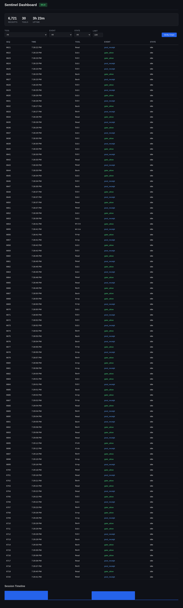

# sentinel-web

Browser-based dashboard for Sentinel. Real-time state visualization, receipt chain browser, and chain verification.

## Install

```bash
npm install -g sentinel-web
```

## Usage

```bash
sentinel-web              # start on port 3000
sentinel-web --port 8080  # custom port
```

Then open http://localhost:3000 in your browser.

## Screenshot



## Features

- Current FSM state badge (color-coded)
- Receipt chain browser with filtering (tool, event, state)
- Chain verification status
- Aggregate statistics (tool counts, event distribution)
- Auto-refresh every 5 seconds

## API Endpoints

- `GET /api/state` — current FSM state + allowed tools
- `GET /api/receipts?tool=Read&event=gate_allow&limit=50` — filtered receipts
- `GET /api/verify` — chain verification result
- `GET /api/stats` — aggregate statistics

## Data Source

Reads directly from Sentinel data files:
- `~/.config/sentinel/data/receipts.jsonl` — receipt chain
- `~/.config/sentinel/data/state.json` — FSM state
- `~/.config/sentinel/data/keys/sentinel.pub` — verification key

## Requirements

- Node.js >= 22, ESM only
- Sentinel must be installed with data at ~/.config/sentinel/

## License

MIT
